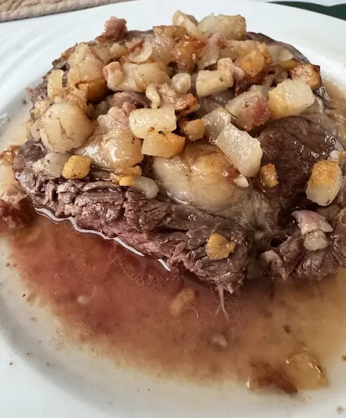

Well... I could call it the "almost third week" of this experiment. Been busy with life. 

Good news is: things are **GREAT**!

### Finally in ketosis

I've got a kit to measure my ketones levels. And after the second week mark, I'm consistently in ketosis.

What is ketosis? It's when you're burning fats instead of carbohydrates to produce energy. There are people who say it's more efficient, because 1g of fat generates more energy than 1g of carbs. But I'm not sure about that. To be honest, don't care much.

What I do care is that I remember that in 2017, when I did the 3 months of keto, there was one day that I played drumns for 2h, ran 5k, cycled 10k... energy seemed endeless. That was not all the time, but that day was imprinted in my memory.

Anyway, I feel good. The trick to get into it faster this time, don't feel that much the keto flu and have enough energy, was to **add more fats**.

### The basic meal: ribeye with added fat

I try to find the fattiest ribeye I can find. At Jumbo, they have something called Ribeye XL, that's the preferred one. Around 360-400g of marbled meat.

And then, I buy either [vetspek blokjes](https://www.jumbo.com/producten/vetspek-blokjes-250-g-663305STK), which is extremelly fatty and, surprisingly cheap (goetkoop)!

I just add half the package on the ribeye, and I'm done. And make sure I capture all the liquid fat that melts from the blokjes. That's so good... I have a teaspoon to make sure I don't left any fat behind.

### FAQ about the diet

#### 1. Don't you get bored of the same meals every day?

Nope. The thing about fat is that it's very satisfying. So I don't crave anything else or need anything different.

#### 2. Don't you get tired of the same meals every day?
Well... not so far. But I do have some variety. A couple days ago we found some Duck meat with a lot of fat. Or some ground meat with fat added. Or salmon. Or some other cuts, like a Picanha, a couple days ago. Ah, yesterday I ate chicken. Then a ribeye with fat. The chicken was just for the flavor.

#### 3. What are you drinking?
Here's a tip: with lots of fat, the best thing is sparkling water. I get San Pelegrino not because it's fancy, but because it's naturally sparkling. So there's no excess CO2 in the water, which makes me burp non-stop.

#### 4. For real? Just water?
And sometimes coffee. 90% of the time, black coffee. Sometimes if I want to indulge, a bit of milk. But that's like once a week, tops. I want to eliminate as much milk as possible, and see the effect when I reintroduce it.

#### 5. How many meals a day? How many calories?
1-2 meals a day. If I eat really lots of fat, I'm just not hungry. How many calories? No clue. It's usually around 500-700g of meat with added fat a day.

And I'm feeling lighter, stronger at the gym (lifting more weight), and I'm feeling more energized. Today I did 30min spinning class (at the gym, prerecorded), and some exercises with a 16kg kettlebell and some stretching. Tomorrow it's going to be heavy lifting. Wednesday I should do a proper 45min spinning class. I feel my energy is coming back to normal to optimal levels.

